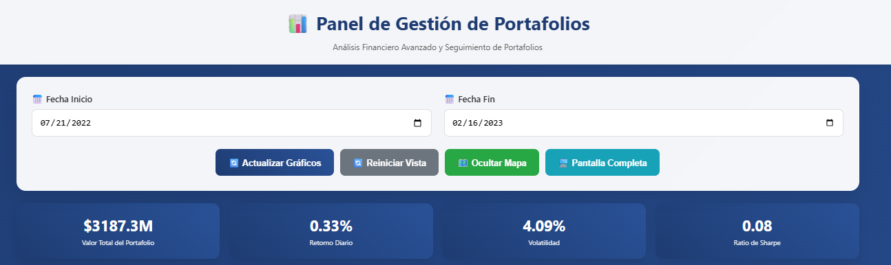

# Portfolio Management (Django)

Sistema completo de gestión de portafolios con ETL desde Excel, API REST, dashboard interactivo y procesamiento de transacciones.

## 📐 Fórmulas Matemáticas Implementadas

El sistema implementa las siguientes relaciones financieras:

**Valor total del portafolio:**

$$
V_t = \sum_{i=1}^{N} x_{i,t}
$$

**Monto por activo:**

$$
x_{i,t} = p_{i,t} \times c_{i,t}
$$

**Peso de cada activo:**

$$
w_{i,t} = \frac{x_{i,t}}{V_t} = \frac{p_{i,t} \times c_{i,t}}{V_t}
$$

**Cantidades iniciales:**

$$
C_{i,0} = \frac{w_{i,0} \times V_0}{P_{i,0}}
$$

Donde:

- $V_t$: Valor total del portafolio en tiempo $t$
- $x_{i,t}$: Monto en dólares del activo $i$ en tiempo $t$
- $p_{i,t}$: Precio del activo $i$ en tiempo $t$
- $c_{i,t}$: Cantidad del activo $i$ en tiempo $t$
- $w_{i,t}$: Peso del activo $i$ en tiempo $t$ (porcentaje del portafolio)
- $V_0 = \$1,000,000,000$: Valor inicial de ambos portafolios

## ✅ Requisitos Cumplidos

### 1. Modelos Django

- `Asset`, `Portfolio`, `AssetPrice`, `PortfolioWeight`, `PortfolioHolding`, `Transaction`
- Implementa todas las relaciones matemáticas: $V_t$, $x_{i,t}$, $w_{i,t}$, $c_{i,0}$

### 2. ETL desde Excel

- Carga automática desde `datos.xlsx` (hojas Weights y Precios)
- Validación de datos y logging detallado en español

### 3. Cálculo de Cantidades Iniciales

- $C_{i,0} = \frac{w_{i,0} \times V_0}{P_{i,0}}$
- $V_0 = \$1,000,000,000$ para ambos portafolios
- Verificación matemática: suma de weights = 1.0

### 4. API REST

- `GET /api/values/` - Retorna $V_t$ por fecha y portafolio
- `GET /api/weights/` - Retorna $w_{i,t}$ por fecha, activo y portafolio
- Filtros por fecha_inicio y fecha_fin
- Uso completo del ORM Django

### 5. Dashboard Interactivo (Bonus 1)

- Gráficos de línea para $V_t$ usando Chart.js
- Gráficos stacked area para $w_{i,t}$
- Controles de fecha interactivos

### 6. Transacciones (Bonus 2)

- Procesamiento de compra/venta (15/05/2022: venta EEUU $200M, compra Europa $200M)
- Recálculo automático de $c_{i,t}$, $x_{i,t}$, $w_{i,t}$, $V_t$ para fechas posteriores
- Optimizado con bulk operations

### 7. Estilo Django (Bonus)

- Estructura modular siguiendo Django-Styleguide
- Management commands, serializers, separación de responsabilidades

## 🚀 Instalación (Windows PowerShell)

```powershell
# Crear entorno virtual
python -m venv venv
.\venv\Scripts\Activate

# Actualizar pip y instalar dependencias
python -m pip install --upgrade pip
python -m pip install -r requirements.txt

# Configurar base de datos
python manage.py makemigrations
python manage.py migrate

# Generar datos de prueba
python data/create_fake_data.py

# Cargar datos y procesar transacción (con manejo de errores mejorado)
python scripts/safe_load_data.py data/datos.xlsx

# Ejecutar servidor (encuentra puerto automáticamente)
python scripts/start_server.py
```

El script `start_server.py` automáticamente:

- ✅ Encuentra un puerto disponible
- ✅ Inicia el servidor Django
- ✅ Muestra las URLs del dashboard y API
- ✅ Maneja errores de puertos ocupados

## 🧪 Dashboard con Pruebas Integradas

Una vez completada la instalación, el dashboard incluye un **sistema de pruebas integrado**:

- **🔍 Verificar Datos**: Cuenta assets, portfolios, holdings, precios y transacciones
- **📊 Probar API**: Testea endpoints de valores y pesos automáticamente
- **🌐 Verificar Puertos**: Muestra puertos disponibles en tiempo real
- **📝 Logs en Tiempo Real**: Visualiza resultados y errores directamente en el dashboard

**No necesitas ejecutar comandos manuales** - todo se puede probar desde la interfaz web.

## 📊 Endpoints Disponibles

- **Dashboard Principal**: `/dashboard/` - Interfaz completa con gráficos y pruebas
- **API Values**: `/api/values/?fecha_inicio=2022-05-15&fecha_fin=2022-05-16`
- **API Weights**: `/api/weights/?fecha_inicio=2022-05-15&fecha_fin=2022-05-16`
- **Test Data**: `/api/test/data/` - Verificación de datos cargados
- **Test Ports**: `/api/test/ports/` - Estado de puertos disponibles

## 📈 Validación Matemática

- ✅ $V_t = \sum_{i=1}^{N} x_{i,t}$ (suma exacta)
- ✅ $x_{i,t} = p_{i,t} \times c_{i,t}$ (verificado)
- ✅ $w_{i,t} = \frac{x_{i,t}}{V_t}$ (suma = 1.0)
- ✅ $C_{i,0} = \frac{w_{i,0} \times V_0}{P_{i,0}}$ calculado correctamente
- ✅ Transacciones aplicadas y recalculadas

## 💭 Reflexión Personal

Honestamente, trabajar con la gestión de portafolios financieros es un área algo nueva según mi experiencia, pero este desafío me ayudó a aprender conceptos nuevos. Muchas gracias por la oportunidad.

### Principales Desafíos y Referencias

**Precisión Decimal**: El mayor problema fue manejar `Decimal.quantize()` bien. Las referencias de [Django money values](https://stackoverflow.com/questions/2013835/django-how-should-i-store-a-money-value) y [decimal precision](https://www.tinystruggles.com/posts/django_decimals/) me ayudaron para evitar errores de precisión.

**ETL Performance**: Con 4,726 cálculos por recalibración, usé patrones de [Django-Pandas ETL](https://www.horilla.com/blogs/how-to-import-data-from-excel-to-django-using-pandas/) y [bulk operations](https://stackoverflow.com/questions/3608487/bulk-create-model-objects-in-django) para optimizar el rendimiento.

**Portfolio Rebalancing**: Me basé en [rebalancing theory](https://quant.stackexchange.com/questions/60876/portfolio-rebalancing-to-optimal-weights-including-transaction-costs-and-without) y [buy/sell algorithms](https://medium.com/@pai.viji/portfolio-rebalancing-the-optimal-buy-sell-dilemma-d166787712b9) para implementar transacciones difíciles.

**Dashboard**: Seguí patrones de [financial dashboards](https://eodhd.medium.com/create-a-financial-trading-dashboard-using-python-and-django-0eb686a25f9b) para crear visualizaciones.

## 📚 Referencias Técnicas

**Core Financial Logic:**

- [Portfolio Rebalancing Theory](https://quant.stackexchange.com/questions/60876/portfolio-rebalancing-to-optimal-weights-including-transaction-costs-and-without)
- [Buy/Sell Algorithms](https://medium.com/@pai.viji/portfolio-rebalancing-the-optimal-buy-sell-dilemma-d166787712b9)

**Decimal Precision:**

- [Django Money Storage](https://stackoverflow.com/questions/2013835/django-how-should-i-store-a-money-value)
- [Django Decimals Advanced](https://www.tinystruggles.com/posts/django_decimals/)

**ETL & Performance:**

- [Django-Pandas ETL](https://www.horilla.com/blogs/how-to-import-data-from-excel-to-django-using-pandas/)
- [Django Bulk Operations](https://stackoverflow.com/questions/3608487/bulk-create-model-objects-in-django)

**Dashboard:**

- [Financial Trading Dashboard](https://eodhd.medium.com/create-a-financial-trading-dashboard-using-python-and-django-0eb686a25f9b)

## 🗂️ Estructura del Proyecto

```
portfolio_management/
├── portfolios/           # App principal
│   ├── models.py        # Modelos de datos
│   ├── views.py         # API endpoints
│   ├── etl.py          # Procesamiento ETL
│   └── management/     # Comandos Django
├── templates/          # Dashboard HTML
├── data/              # Datos Excel
└── requirements.txt   # Dependencias
```

## 📊 Screenshots




## 🔧 Solución de Problemas

### Error de pip en entorno virtual

Si obtienes un error como "Unable to create process using python.exe", usa:

```powershell
# En lugar de solo pip install
python -m pip install --upgrade pip
python -m pip install -r requirements.txt
```

### Error de permisos de puerto

Si obtienes "You don't have permission to access that port", usa el script de verificación:

```powershell
# Verificar puertos disponibles
python scripts/check_ports.py

# Usar puerto recomendado (ejemplo: 3000)
python manage.py runserver 3000

# O liberar un puerto específico si está ocupado
python scripts/check_ports.py --kill 8000
```

Puertos alternativos comunes: `3000`, `5000`, `8080`, `8888`, `9000`

### Error de decimales durante cálculos

Si aún obtienes errores de `decimal.InvalidOperation`, usa el script de carga segura:

```powershell
# En lugar de python manage.py load_data
python scripts/safe_load_data.py data/datos.xlsx
```

Este script:

- ✅ Maneja errores de precisión decimal automáticamente
- ✅ Detecta y omite cantidades negativas problemáticas
- ✅ Proporciona logging detallado de errores
- ✅ Continúa procesando aunque algunos cálculos fallen
